# SAMS System Architecture Diagram

## Purpose
This document visualizes the complete system architecture for SAMS using a layered, three-tier architecture pattern.

---

## High-Level Architecture Overview

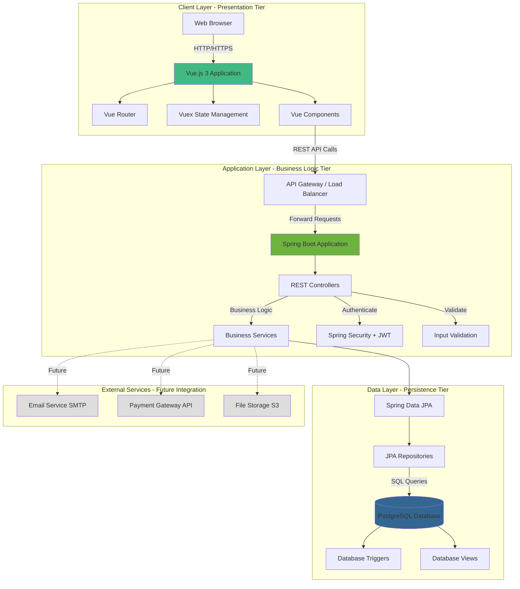

---

## Detailed Layer Architecture

### 1. Presentation Layer (Frontend - Vue.js)

```mermaid
graph TD
    subgraph "Vue.js Frontend Architecture"
        A[main.js - App Entry Point] --> B[App.vue - Root Component]
        B --> C[Vue Router]
        B --> D[Vuex Store]

        C --> E1[Student Views]
        C --> E2[Faculty Views]
        C --> E3[Admin Views]
        C --> E4[Public Views]

        E1 --> F1[Dashboard]
        E1 --> F2[Course Registration]
        E1 --> F3[Grades View]
        E1 --> F4[Payment Submit]

        E2 --> G1[Faculty Dashboard]
        E2 --> G2[Course Management]
        E2 --> G3[Grade Entry]

        E3 --> H1[Admin Dashboard]
        E3 --> H2[User Management]
        E3 --> H3[Payment Validation]
        E3 --> H4[Reports]

        D --> I1[Auth Module]
        D --> I2[Student Module]
        D --> I3[Course Module]

        J[Axios HTTP Client] --> K[API Service Layer]
        K --> L[Backend REST API]

        F1 --> K
        F2 --> K
        G1 --> K
        H1 --> K
    end

    style A fill:#42b983
    style B fill:#42b983
    style C fill:#35495e
    style D fill:#35495e
```

**Key Components:**
- **Router**: Client-side routing (SPA - Single Page Application)
- **Vuex Store**: Centralized state management
- **API Service**: Axios-based HTTP client with interceptors
- **Views**: Page-level components for each user role
- **Components**: Reusable UI components (forms, tables, cards)

---

### 2. Application Layer (Backend - Spring Boot)

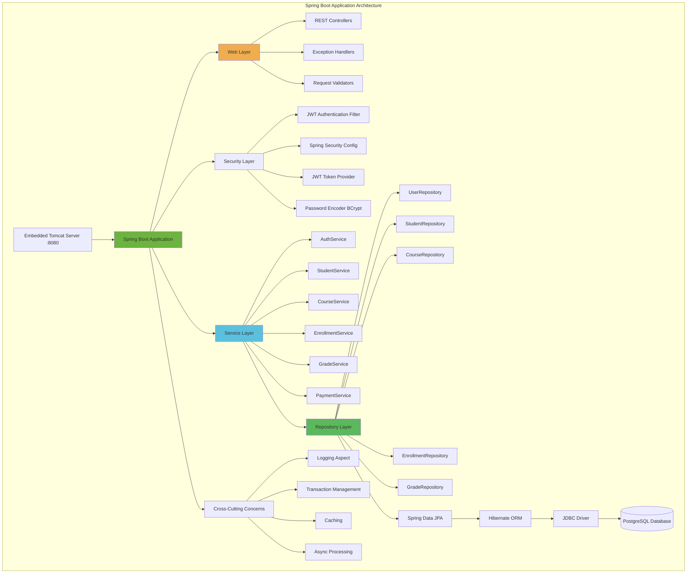

**Layering Principle:**
- **Controllers**: Handle HTTP requests/responses, delegate to services
- **Services**: Business logic, transaction management
- **Repositories**: Data access abstraction
- **Cross-cutting**: Logging, caching, async, security

---

### 3. Data Layer (Persistence - PostgreSQL)

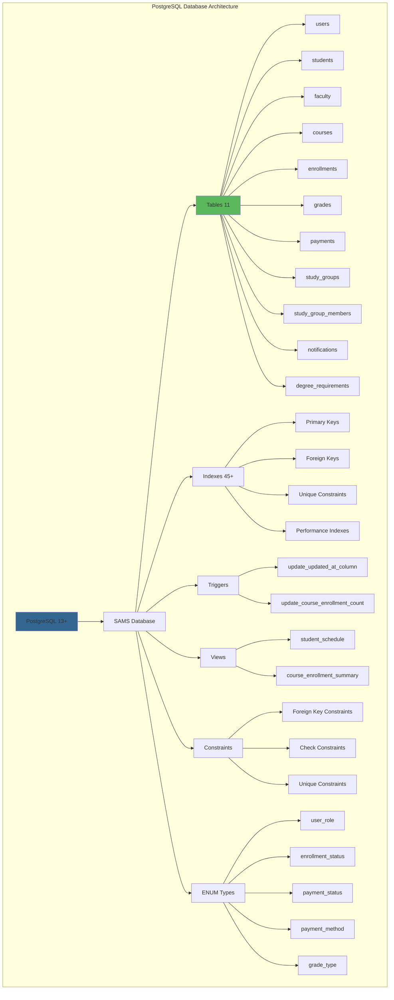

---

## Deployment Architecture (Production)

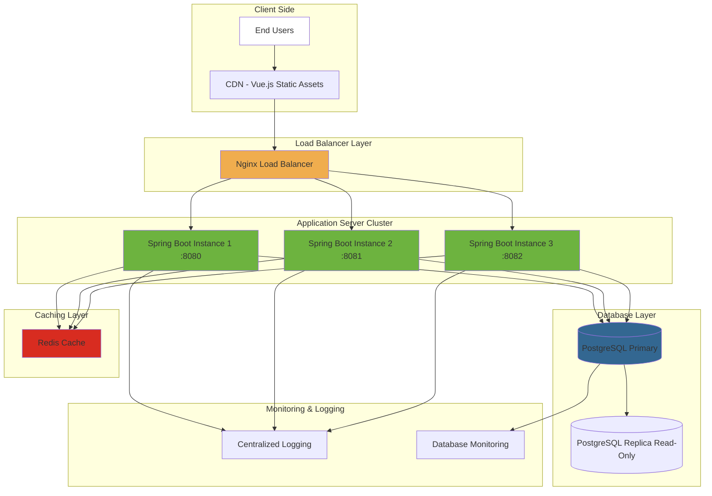

**Scalability Features:**
- **Horizontal Scaling**: Multiple Spring Boot instances behind load balancer
- **Stateless API**: JWT enables any instance to handle any request
- **Database Replication**: Read replicas for query load distribution
- **Caching**: Redis for session data and frequently accessed resources

---

## Request Flow Diagram

### Typical API Request Flow

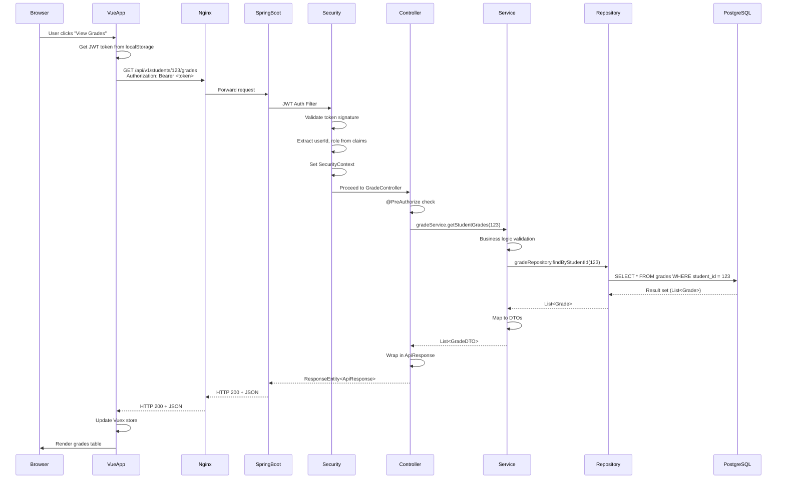

---

## Component Interaction Diagram

### Major System Components and Their Interactions

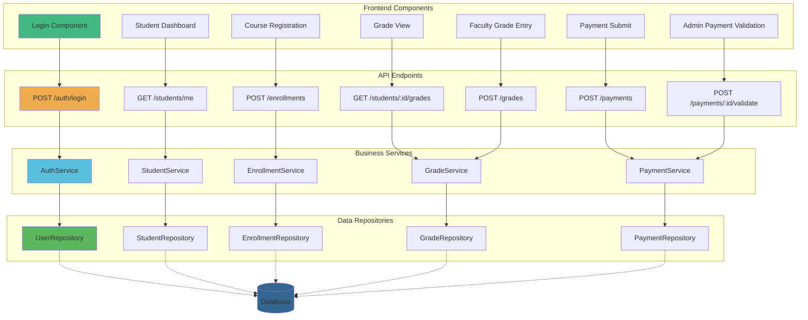

---

## Technology Stack Diagram

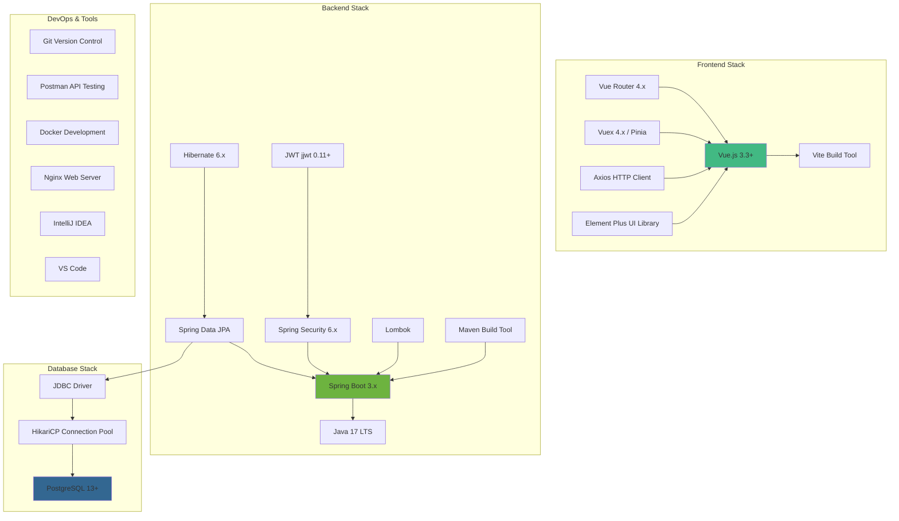

---

## Security Architecture

```mermaid
graph TD
    subgraph "Security Layers"
        A[HTTPS/TLS Layer]
        B[CORS Configuration]
        C[JWT Authentication]
        D[Role-Based Authorization RBAC]
        E[Input Validation]
        F[SQL Injection Prevention]
        G[XSS Protection]
        H[CSRF Protection]
    end

    subgraph "Authentication Flow"
        I[Login Request] --> J[Validate Credentials]
        J --> K[BCrypt Password Check]
        K --> L[Generate JWT Token]
        L --> M[Return Token to Client]
        M --> N[Client stores in localStorage]
        N --> O[Include in Authorization header]
    end

    subgraph "Authorization Flow"
        P[Incoming Request] --> Q[Extract JWT from header]
        Q --> R[Validate JWT signature]
        R --> S[Extract user role from claims]
        S --> T[Check @PreAuthorize annotation]
        T --> U{Has Permission?}
        U -->|Yes| V[Process Request]
        U -->|No| W[Return 403 Forbidden]
    end

    A --> B
    B --> C
    C --> D
    D --> E
    E --> F
    F --> G
    G --> H

    style C fill:#f0ad4e
    style D fill:#5bc0de
    style K fill:#d9534f
```

**Security Features:**
- **HTTPS Only**: All production traffic encrypted
- **JWT Tokens**: Stateless authentication
- **BCrypt Hashing**: Password encryption (strength 12)
- **Role-Based Access**: STUDENT, FACULTY, ADMIN roles
- **Input Validation**: Bean Validation + custom validators
- **Prepared Statements**: JPA prevents SQL injection
- **CORS**: Configured for specific origins only

---

## Data Flow Architecture

### Write Operation (Example: Enroll in Course)

```mermaid
graph LR
    A[User Action] --> B[Vue Component]
    B --> C[Vuex Action]
    C --> D[API Service]
    D --> E[POST /enrollments]
    E --> F[Spring Controller]
    F --> G[EnrollmentService]
    G --> H{Validate Business Rules}
    H -->|Prerequisites Met?| I[Check Course Capacity]
    I -->|Has Space?| J[Create Enrollment]
    J --> K[Repository.save]
    K --> L[JPA persist]
    L --> M[SQL INSERT]
    M --> N[(Database)]
    N --> O[Trigger: Update course count]
    O --> N
    N --> P[Return saved entity]
    P --> Q[Map to DTO]
    Q --> R[Return API Response]
    R --> S[Update Vuex State]
    S --> T[Render UI Update]

    style A fill:#42b983
    style G fill:#5bc0de
    style N fill:#336791
```

### Read Operation (Example: View Grades)

```mermaid
graph LR
    A[Page Load] --> B[Vue Component mounted]
    B --> C[Dispatch fetchGrades]
    C --> D[API Service]
    D --> E[GET /students/:id/grades]
    E --> F[Spring Controller]
    F --> G{Check Authorization}
    G -->|Authorized| H[GradeService]
    H --> I[Repository.findByStudentId]
    I --> J[JPA query]
    J --> K[SQL SELECT with JOINs]
    K --> L[(Database)]
    L --> M[Result Set]
    M --> N[Map to entities]
    N --> O[Map to DTOs]
    O --> P[Return API Response]
    P --> Q[Store in Vuex]
    Q --> R[Component re-renders]
    R --> S[Display grades table]

    style A fill:#42b983
    style H fill:#5bc0de
    style L fill:#336791
```

---

## Integration Points

### Current Integrations

| Component | Integration Type | Protocol | Purpose |
|-----------|------------------|----------|---------|
| Frontend → Backend | REST API | HTTP/HTTPS + JSON | All client-server communication |
| Backend → Database | JDBC | TCP/IP | Data persistence and retrieval |
| Client → Auth | JWT Bearer Token | HTTP Header | Stateless authentication |

### Future Integrations (Phase 2)

| Component | Integration Type | Protocol | Purpose |
|-----------|------------------|----------|---------|
| Email Service | SMTP | SMTP/TLS | Notifications, password reset |
| Payment Gateway | REST API | HTTPS + JSON | Online payment processing |
| File Storage | S3 API | HTTPS | Document uploads (transcripts, proofs) |
| SMS Gateway | REST API | HTTPS | SMS notifications |
| Analytics | REST API | HTTPS | Usage analytics and reporting |

---

## Architectural Patterns Used

### 1. **Layered Architecture (N-Tier)**
- Clear separation of concerns
- Presentation → Business → Data layers
- Each layer depends only on layer below

### 2. **Model-View-Controller (MVC)**
- Vue.js: View layer (Components)
- Spring Controllers: Controller layer
- Services + Repositories: Model layer

### 3. **Repository Pattern**
- Abstraction over data access
- Spring Data JPA repositories
- Decouples business logic from persistence

### 4. **Service Layer Pattern**
- Business logic encapsulation
- Transaction boundaries
- Orchestrates repository calls

### 5. **Data Transfer Object (DTO) Pattern**
- Decouples API contracts from entities
- Prevents over-fetching/under-fetching
- API versioning flexibility

### 6. **Dependency Injection**
- Spring's IoC container
- Constructor injection (preferred)
- Promotes testability

---

## Performance Optimizations

### Frontend Optimizations
- **Lazy Loading**: Routes loaded on-demand
- **Component Code Splitting**: Vite chunks
- **Asset Optimization**: Minification, compression
- **Caching**: Service Worker (future), browser cache

### Backend Optimizations
- **Connection Pooling**: HikariCP (20 connections)
- **JPA Fetch Strategies**: JOIN FETCH to prevent N+1
- **Query Optimization**: Proper indexing
- **Caching**: Spring Cache (in-memory)
- **Async Processing**: @Async for non-blocking operations

### Database Optimizations
- **Indexes**: 45+ strategic indexes
- **Denormalization**: GPA, enrollment counts stored
- **Triggers**: Auto-update calculated fields
- **Views**: Pre-computed complex queries
- **Partitioning**: Future - partition by semester

---

## Scalability Considerations

### Horizontal Scaling
- **Stateless Backend**: JWT enables multiple instances
- **Load Balancer**: Nginx distributes traffic
- **Session-less**: No server-side session state
- **Database Pooling**: Each instance has own pool

### Vertical Scaling
- **JVM Tuning**: Heap size, GC configuration
- **Database Resources**: CPU, RAM, storage
- **Connection Limits**: Increase pool size

### Caching Strategy
- **Application Cache**: Spring Cache (courses, students)
- **Database Cache**: PostgreSQL shared buffers
- **CDN**: Static assets (Vue.js build)
- **Future: Redis**: Distributed caching

---

## Monitoring & Logging

### Application Monitoring
- **Logging**: SLF4J + Logback
- **Metrics**: Spring Actuator (future)
- **Health Checks**: `/actuator/health`
- **Performance**: Method execution time logging

### Database Monitoring
- **Slow Query Log**: Queries > 1 second
- **Connection Pool Stats**: HikariCP metrics
- **Index Usage**: pg_stat_user_indexes

---

## Disaster Recovery

### Backup Strategy
- **Database Backups**: Daily full, hourly incremental
- **Application Logs**: Retained for 30 days
- **Configuration**: Version controlled (Git)

### High Availability (Future)
- **Database Replication**: Primary + Read replica
- **Failover**: Automatic promotion of replica
- **Geographic Distribution**: Multi-region deployment

---

## Compliance with SRS Requirements

| Architectural Decision | SRS Requirement Satisfied |
|------------------------|---------------------------|
| Three-tier architecture | NFR-5.4 (Modularity and Maintainability) |
| JWT authentication | NFR-4.1 (Security and Data Protection) |
| RESTful API design | NFR-5.1 (Code Quality and Best Practices) |
| PostgreSQL with triggers | NFR-3.2 (Fault Tolerance - data consistency) |
| Stateless backend | NFR-1.4 (Scalability) |
| Connection pooling | NFR-1.1 (Response Time < 3 seconds) |
| Role-based authorization | FR-1.2 (Authorization and Access Control) |
| Vue.js SPA | NFR-2.1 (Cross-Platform Compatibility) |

---

**Document Status:** Complete
**Architecture Type:** Three-Tier Layered Architecture
**Scalability:** Horizontal and Vertical scaling ready
**Next Step:** Component specifications documentation
