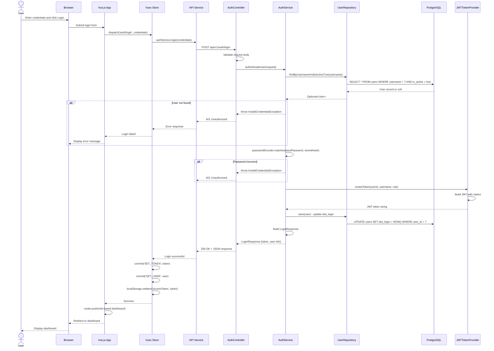
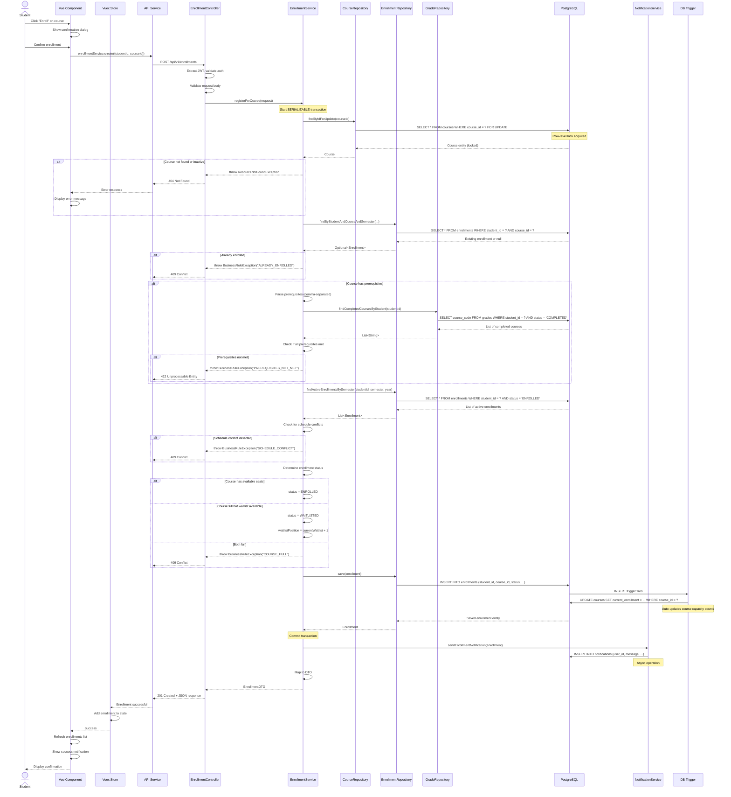
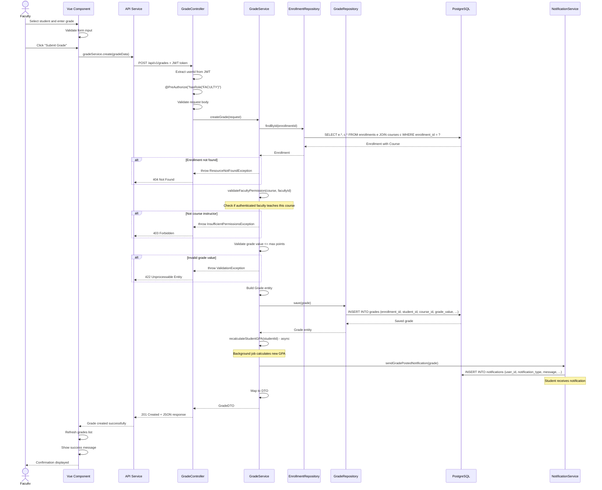
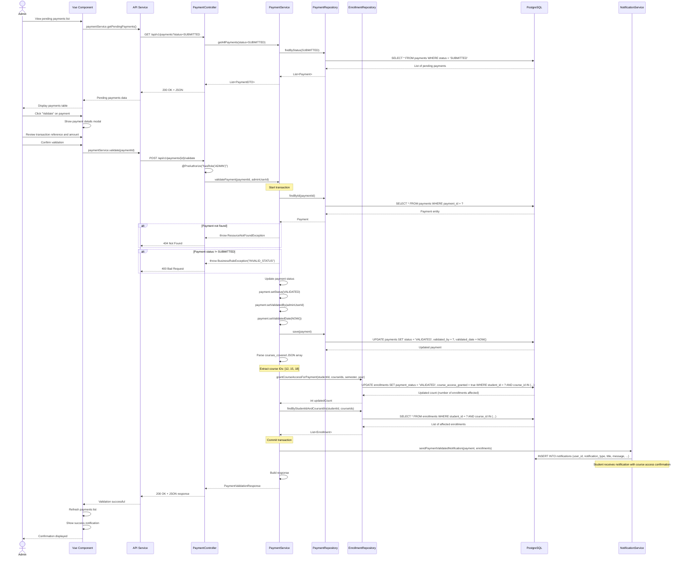
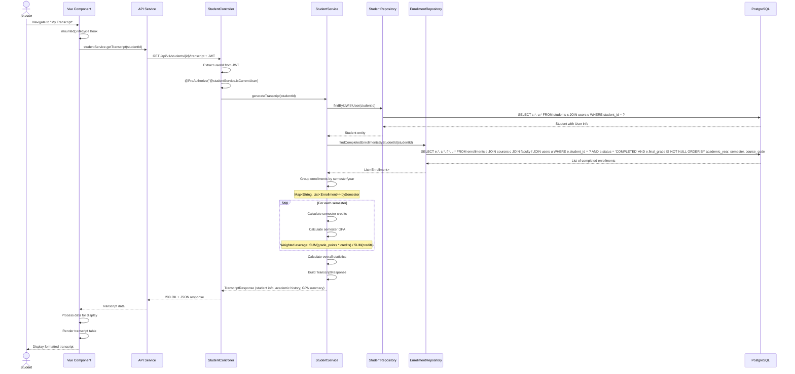
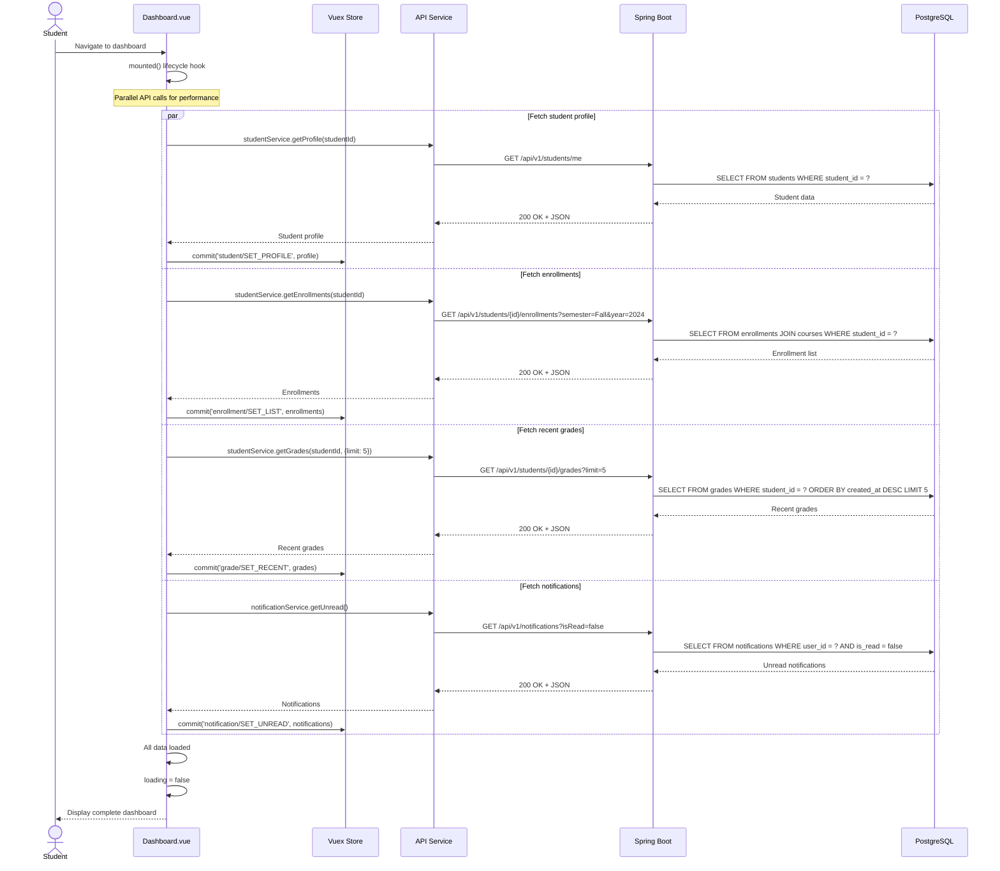

# SAMS Sequence Diagrams - Key Workflows

## Purpose
This document provides detailed sequence diagrams for the major workflows in SAMS, showing the interactions between system components.

---

## 1. User Login Workflow



**Key Points:**
- BCrypt password verification (secure, slow by design)
- JWT token contains userId, username, role
- Token stored in localStorage (accessible across sessions)
- last_login updated asynchronously
- Role-based redirect (Student/Faculty/Admin dashboard)

---

## 2. Course Registration Workflow



**Critical Aspects:**
- **SERIALIZABLE transaction**: Prevents race conditions during concurrent enrollment
- **Row-level lock (FOR UPDATE)**: Ensures course capacity check is atomic
- **Business rule validation**:
  1. Prerequisites check
  2. Schedule conflict detection
  3. Capacity verification
- **Database trigger**: Auto-updates `current_enrollment` count
- **Notification**: Async operation doesn't block response

---

## 3. Grade Entry Workflow (Faculty)



**Key Validation Points:**
- **Authorization**: Only course instructor can enter grades for that course
- **Input validation**: Grade value must not exceed max points
- **Denormalized FKs**: `student_id` and `course_id` stored in grades table for query performance
- **GPA recalculation**: Async job triggered after grade entry
- **Student notification**: Student notified of new grade

---

## 4. Payment Validation Workflow (Admin)



**Transaction Boundaries:**
- Payment status update and enrollment access grant must be atomic
- If enrollment update fails, payment status rollback
- Ensures data consistency

**Business Impact:**
- Student cannot access course content until payment validated
- Enrollment record tracks payment status separately
- Admin audit trail (who validated, when)

---

## 5. View Student Transcript Workflow



**Transcript Structure:**
```json
{
  "student": {
    "studentNumber": "STU2024001",
    "firstName": "Sarah",
    "lastName": "Johnson",
    "major": "Computer Science"
  },
  "academicHistory": [
    {
      "semester": "Fall",
      "academicYear": 2024,
      "courses": [
        {
          "courseCode": "CS301",
          "courseName": "Data Structures",
          "credits": 3,
          "finalGrade": "A",
          "gradePoints": 4.0,
          "instructor": "Dr. Michael Smith"
        }
      ],
      "semesterCredits": 14,
      "semesterGpa": 3.85
    }
  ],
  "summary": {
    "totalCreditsCompleted": 24,
    "cumulativeGpa": 3.75,
    "academicStanding": "GOOD_STANDING"
  }
}
```

**Performance Optimization:**
- Single query with JOINs (not N+1 queries)
- Application-level GPA calculation (flexible logic)
- Can be cached (transcripts don't change frequently)

---

## 6. Dashboard Data Loading Workflow



**Performance Strategy:**
- **Parallel API calls**: Reduces total load time
- **Pagination/Limiting**: Fetch only needed data (recent 5 grades)
- **Lazy loading**: Additional data loaded on-demand (e.g., full grade history)
- **Caching**: Vuex store caches data across page navigations

---

## Workflow Summary

| Workflow | Key Components | Transaction Type | Critical Validation |
|----------|----------------|------------------|---------------------|
| **Login** | AuthService, JwtTokenProvider | Read-only | Password verification, account active |
| **Course Registration** | EnrollmentService, Triggers | SERIALIZABLE | Prerequisites, capacity, schedule |
| **Grade Entry** | GradeService, NotificationService | Standard | Faculty authorization, value range |
| **Payment Validation** | PaymentService, EnrollmentRepository | Standard (multi-table update) | Payment status, course matching |
| **Transcript Generation** | StudentService, EnrollmentRepository | Read-only | Student authorization only |
| **Dashboard Load** | Multiple services | Read-only (parallel) | JWT validation per request |

---

**Document Status:** Complete
**Workflows Documented:** 6 critical business processes
**Diagram Type:** Mermaid sequence diagrams
**Next Step:** Data flow explanation documentation
